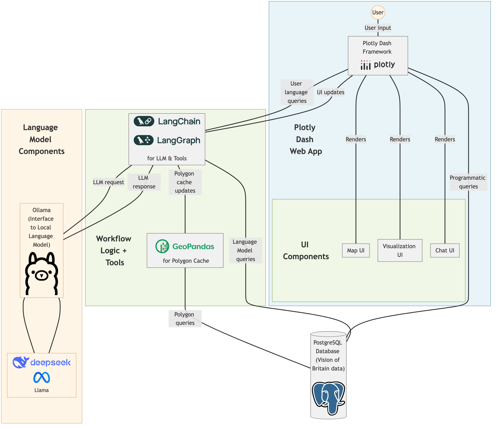

## DDME Prototype: A Conversational AI Dashboard

This project is a prototype for a Dynamic Data and Multimodal Engagement (DDME) system. It combines a chat interface with a map and visualizations to allow users to explore statistical data in a conversational manner.

### Architecture

The system architecture is illustrated in the diagram below:



**Key components:**

* **Plotly Dash Web App:** Provides the user interface (UI) with a chat component, a map component, and a visualization component.
* **LangChain & LangGraph:** Facilitate interaction with the language model (LLM) and manage the workflow logic.
* **Ollama:** An interface to a local language model (LLM) such as Llama.
* **PostgreSQL Database:** Stores the statistical data (in this case, Vision of Britain data).
* **GeoPandas:** Used for handling geospatial data and polygon information.
* **Workflow Logic & Tools:** Custom Python code that defines the workflow steps, database queries, and data processing.

### Workflow

The user interacts with the system through the chat interface. The workflow processes the user's input and responds with information and visualizations. The main steps include:

1. **Query Extraction:** The LLM extracts key information from the user's query, such as place names, themes, and year ranges.
2. **Data Retrieval:** Based on the extracted information, the system queries the database to retrieve relevant data.
3. **Visualization:** The retrieved data is displayed on the map and/or as charts and graphs.
4. **User Interaction:** The user can further refine their query or explore different aspects of the data through the chat interface.

### Code Structure

The code is organized into the following directories and files:

* **app:** Contains the main application code.
    * `main.py`: Initializes the Dash app, defines the layout, and registers callbacks.
    * `workflow.py`: Defines the workflow logic and nodes using LangGraph.
    * `callbacks`: Contains callback functions for handling user interactions.
        * `chat.py`: Callbacks for the chat interface.
        * `map_leaflet.py`: Callbacks for the map component.
        * `visualization.py`: Callbacks for the visualization component.
        * `clientside_callbacks.py`: Client-side callbacks for UI updates.
    * `components`: Contains UI components.
        * `chat.py`: Defines the chat layout.
        * `map.py`: Defines the map layout.
        * `visualization.py`: Defines the visualization layout.
    * `config.py`: Loads configuration settings.
    * `stores.py`: Manages data stores for the application state.
    * `tools.py`: Provides helper functions for database queries.
    * `utils`: Contains utility functions and constants.
        * `constants.py`: Defines constants for unit types and themes.
        * `polygon_cache.py`: Caches polygon data for faster retrieval.

### Installation and Running

#### Local Development
1. Clone the repository.
2. Install the required packages: `pip install -r requirements.txt`.
3. Configure the database connection in `config.py`.
4. Run the app: `python -m vobchat.app`.

#### Docker Installation

For easier deployment, VobChat can be run in a Docker container with Redis included, while connecting to external Ollama and PostgreSQL services.

**Prerequisites:**
- Docker and Docker Compose installed
- Ollama server running on localhost:11434
- PostgreSQL database running on localhost:5432

**Setup:**
1. Clone the repository
2. Copy the environment template: `cp .env.example .env`
3. Update `.env` with your database credentials:
   ```bash
   DB_HOST=host.docker.internal
   DB_PORT=5432
   DB_NAME=vobchat
   DB_USER=postgres
   DB_PASSWORD=your_postgres_password
   SECRET_KEY=your-production-secret-key-here
   ```
4. Build and run: `docker-compose up --build`
5. Create a login user: `docker-compose exec vobchat flask --app vobchat.app:server add-user admin@example.com`
6. Access the application at `http://localhost:8050`

**Running in Background:**
To run the container in the background (detached mode):
```bash
docker-compose up -d --build
```

**Managing the Background Container:**
* View logs: `docker-compose logs -f vobchat`
* Stop container: `docker-compose down`
* Restart container: `docker-compose restart`
* Check status: `docker-compose ps`
* Create user (while running): `docker-compose exec vobchat python create_user.py testuser@email.com password`

**Docker Architecture:**
- **Internal**: Redis server runs inside the container
- **External**: Connects to Ollama (port 11434) and PostgreSQL (port 5432) on host system
- **Networking**: Uses host networking mode for seamless access to host services
- **Logging**: Persistent log directory mounted as volume

**Environment Variables:**
* `DB_HOST`: Database host (default: host.docker.internal)
* `DB_PORT`: Database port (default: 5432)
* `DB_NAME`: Database name (default: vobchat)
* `DB_USER`: Database username (default: postgres)
* `DB_PASSWORD`: Database password
* `OLLAMA_HOST`: Ollama server host (default: host.docker.internal)
* `OLLAMA_PORT`: Ollama server port (default: 11434)
* `REDIS_HOST`: Redis host (default: localhost - internal to container)
* `REDIS_PORT`: Redis port (default: 6379)
* `SECRET_KEY`: Flask secret key for session security (required for login)
* `DATABASE_URL`: User authentication database URL (default: sqlite:///users.db)

**Authentication:**
The application requires user authentication via Flask-Login. Users must log in with email/password before accessing the chat interface. Use the `flask add-user` command to create accounts.

**Ollama Integration:**

`ollama show deepseek-r1:latest --modelfile > deepseekr1_wt.modelfile`

change the model template in that file. Then create a new model file with the command:

```bash
ollama create deepseek-r1-wt --modelfile deepseekr1_wt.model
```

### Future Work

* So much to do!
