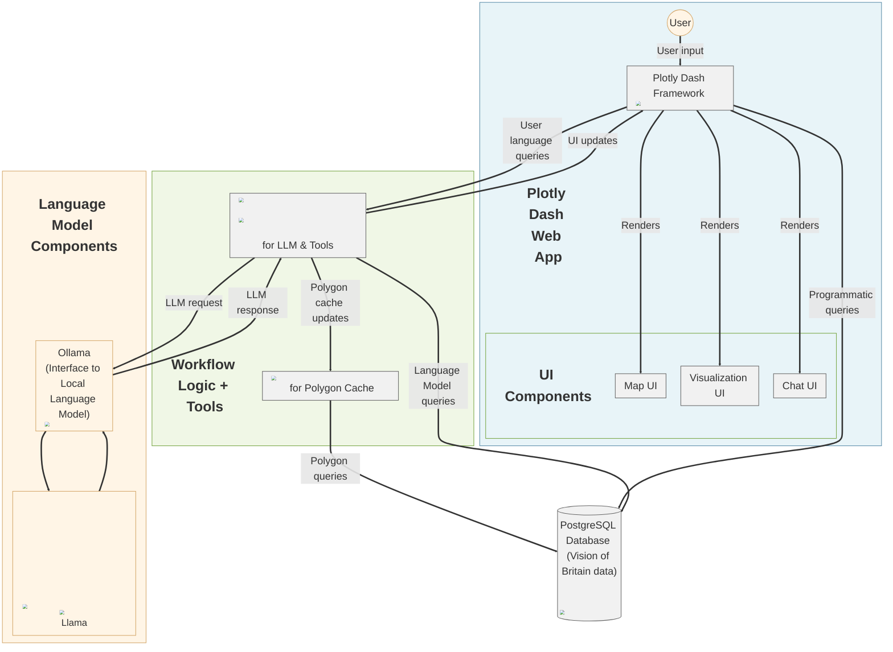

```mermaid
flowchart TB
    %% Styling
    classDef container fill:#e8f4f8,stroke:#5a8ca8,stroke-width:2px,font-size:36pt
    classDef dashmodule fill:#e8f4f8,stroke:#76a543,stroke-width:2px,font-size:36pt;
    classDef toolsmodule fill:#f0f7e6,stroke:#76a543,stroke-width:2px,font-size:36pt;
    classDef titleNode fill:transparent,stroke:transparent,font-size:36pt,font-weight:bold;
    classDef node fill:#f1f1f1,stroke:#666666,stroke-width:2px,font-size:26pt;
    classDef database fill:#f1f1f1,stroke:#666666,stroke-width:2px,font-size:26pt;
    classDef external fill:#fff5e6,stroke:#d4a76a,stroke-width:2px,font-size:26pt;
    %% Larger link text and arrow size
    linkStyle default stroke-width:5px,fill:none,font-size:26pt

    
    %% Main container
    subgraph DashWebApp[" "]
        direction TB
        dashTitle["Plotly Dash Web App"]:::titleNode
        %% User
        User((User<br>))

        
        Framework[Plotly Dash Framework <p style='width:300px;margin:0px'/p><img src='///Users/xangma/Library/CloudStorage/OneDrive-Personal/repos/vobchat/assets/Plotly-logo.png'/>]:::node
        
        subgraph UIComponents[" "]
            direction TB
            uiTitle["UI Components"]:::titleNode
            MapUI[Map UI] 
            VisUI[Visualization UI]
            ChatUI[Chat UI]
        end
        
    end

    subgraph Tools[" "]
        direction TB
        toolsTitle["Workflow Logic + Tools"]:::titleNode
        LangChain[
            <p style='width:400px;margin:0px'/p><img src='///Users/xangma/Library/CloudStorage/OneDrive-Personal/repos/vobchat/assets/LangChain-logo.svg'/><br><img src='///Users/xangma/Library/CloudStorage/OneDrive-Personal/repos/vobchat/assets/LangGraph-logo.svg'/><br>for LLM & Tools ]
        Cache[<p style='width:400px;margin:0px'/p><img src='///Users/xangma/Library/CloudStorage/OneDrive-Personal/repos/vobchat/assets/geopandas_logo.svg'/> for Polygon Cache]
    end
    
    %% External components
    subgraph LMC[" "]
        direction TB
        lmcTitle["Language Model Components"]:::titleNode
        Ollama["Ollama<br>(Interface to Local Language Model)<img src='///Users/xangma/Library/CloudStorage/OneDrive-Personal/repos/vobchat/assets/ollama.svg'/>"]:::external
        LLM["
            <table>
                <tr>
                    <td><p style='width:350px;margin:0px'/p><img src='///Users/xangma/Library/CloudStorage/OneDrive-Personal/repos/vobchat/assets/DeepSeek_logo.svg'/></td>
                </tr>
                <tr>
                    <td align='center'><p style='width:100px;margin:0px'/p><img src='///Users/xangma/Library/CloudStorage/OneDrive-Personal/repos/vobchat/assets/meta-color.svg'/><font size='6'>Llama</font></td>
                </tr>
            </table>
        "]
    end

    DB[("PostgreSQL Database (Vision of Britain data)<br>
        <img src='///Users/xangma/Library/CloudStorage/OneDrive-Personal/repos/vobchat/assets/Postgresql_elephant.svg'/>
        ")]:::database
    
    %% Connections with labels
    User --> |"User input"| Framework
    
    Framework ---> |"Renders"| MapUI
    Framework ---> |"Renders"| VisUI
    Framework ---> |"Renders"| ChatUI
    
    Framework --> |"User language queries"| LangChain
    LangChain --> |"LLM request"| Ollama
    LLM --> Ollama
    Ollama --> LLM 
    Ollama --> |"LLM response"| LangChain
    LangChain --> |"Polygon cache updates"| Cache
    LangChain --> |"UI updates"| Framework

    Cache --> |"Polygon queries"| DB
    Framework --> |"Programmatic queries"| DB
    LangChain --> |"Language Model queries"| DB

    dashTitle ~~~ DashWebApp
    LMC ~~~ DashWebApp

    %% Apply styles
    class DashWebApp container
    class UIComponents dashmodule
    class Tools toolsmodule
    class DB database
    class LLM external
    class Ollama external
    class User external
    class LMC external
```
[comment]: <> (To render the diagram, use the following command:)
[comment]: <> (mmdc -i diagram.md -o diagram.png -s 3)